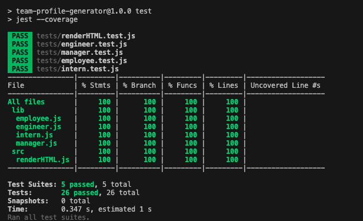

# team-profile-generator

  ## Description
  
  A node based command line program to generate a basic webpage for a team!
  
  ## License
  [](https://opensource.org/licenses/MIT)
  
  ## Table of contents
  1. [Installation](#Installation)
  2. [Usage](#Usage)
  3. [Contributing](#Contributing)
  4. [Tests](#Tests)
  5. [Questions](#Questions)
  ## Installation
  
  Download/clone the files then in a command line navigate to the directory you downloaded in and run ```npm install```

  ## Usage
  
  in the same directory you installed in run ```node index``` to run the program and answer the prompts which appear in the command line. An HTML file with some basic css will be created in the local directory

  Like to walkthrough video [here](https://streamable.com/ljenbz).

  ## Contributing
  
  Contact me for information.

  ## Tests
  
  Tests with jest.
  In the main directory run ```npm test```
  


  ## Questions
  Contact

  Github: [SeanOVery](https://github.com/SeanOVery)

  Email: seanovery1@gmail.com

